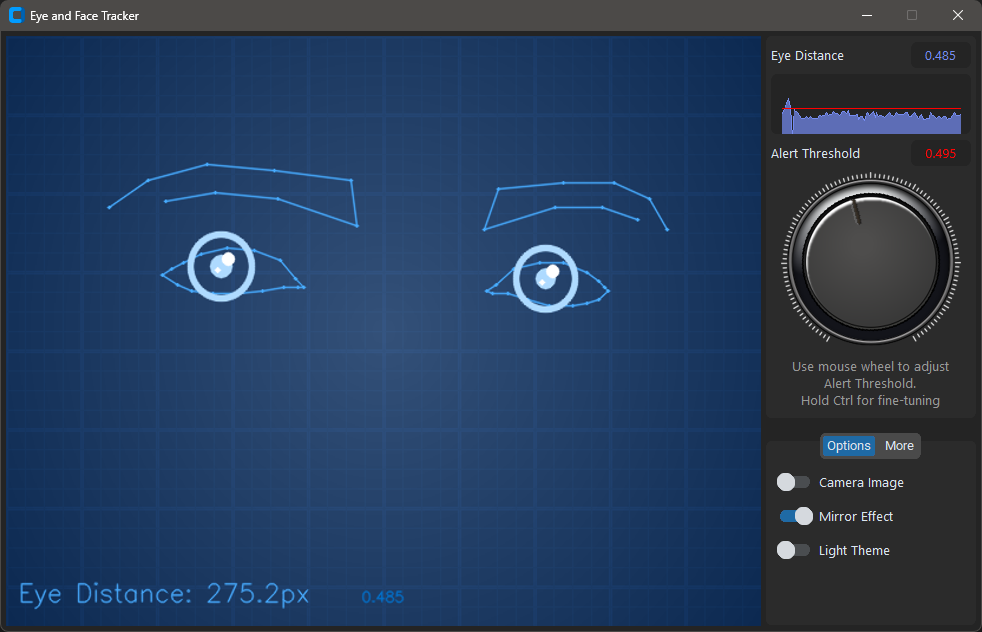
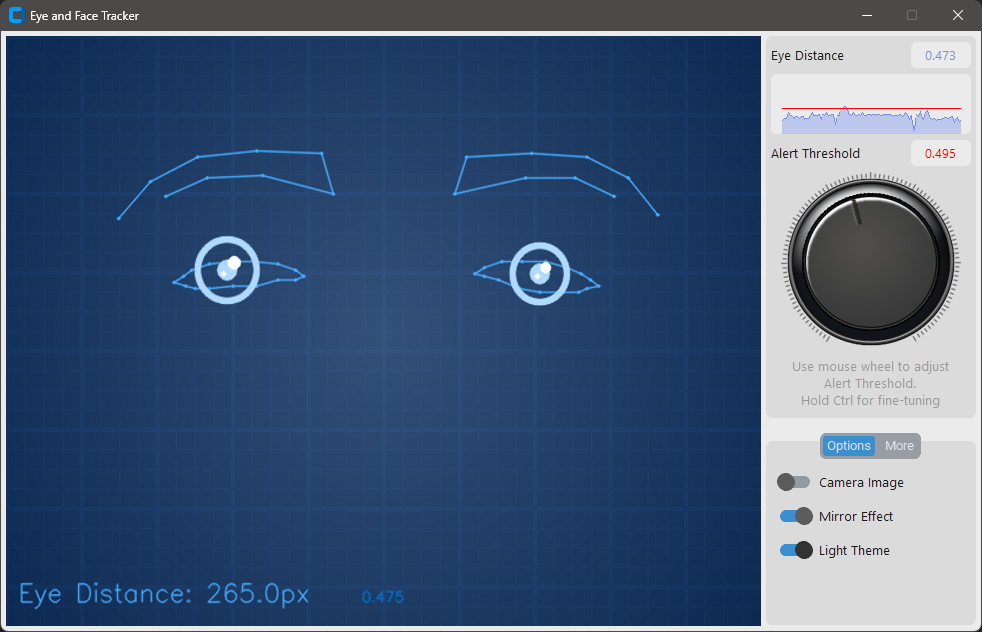

# GazeTracker

> Real-time vision defects self-monitoring and correction assistant with gaze tracking capabilities

[](https://www.python.org/downloads/)
[](https://opencv.org/)
[](https://mediapipe.dev/)
[](https://opensource.org/licenses/MIT)

<div style="display: flex; justify-content: space-between;">
  
  
</div>

[English](#english) | [Русский](#русский)

---

### Overview
GazeTracker is a specialized application designed to assist in self-monitoring and correction of vision defects. While it uses computer vision to track user's gaze and facial movements in real-time, its primary purpose is to help users maintain better control over their vision problems. The application alerts users when vision defects are detected, allowing them to perform immediate self-correction exercises.

Built with Python, it combines the power of OpenCV and MediaPipe for accurate facial feature detection and tracking, making it an effective tool for vision self-monitoring.

### Features
- Real-time detection and alerts for vision defects
- Immediate feedback for vision self-correction
- Real-time eye tracking
- Face detection and tracking
- Customizable alert window
- Adjustable settings and parameters

### Requirements
- Python 3.8+
- OpenCV
- MediaPipe
- NumPy
- CustomTkinter
- CTkChart
- CTkColorPicker

### Installation
1. Clone the repository
2. Install dependencies:
```bash
pip install -r requirements.txt
```
3. Run the application:
```bash
python main.pyw
```

### Usage
1. Launch the application
2. Adjust the settings according to your needs
3. Position your face in front of the camera
4. You will be notified when a visual defect is detected

### Acknowledgments
Inspired by [Python-Gaze-Face-Tracker](https://github.com/alireza787b/Python-Gaze-Face-Tracker)

---

### Обзор
GazeTracker - это специализированное приложение, разработанное для помощи в самоконтроле и коррекции дефектов зрения. Хотя оно использует компьютерное зрение для отслеживания взгляда и движений лица в реальном времени, его основное назначение - помочь пользователям поддерживать лучший контроль над проблемами зрения. Приложение оповещает пользователей при обнаружении дефектов зрения, позволяя выполнить немедленную самокоррекцию.

Построенное на Python, оно объединяет возможности OpenCV и MediaPipe для точного определения и отслеживания черт лица, что делает его эффективным инструментом для самоконтроля зрения.

### Возможности
- Обнаружение дефектов зрения и оповещения в реальном времени
- Мгновенная обратная связь для самокоррекции зрения
- Отслеживание взгляда в реальном времени
- Определение и отслеживание лица
- Настраиваемое окно оповещений
- Настраиваемые параметры

### Требования
- Python 3.8+
- OpenCV
- MediaPipe
- NumPy
- CustomTkinter
- CTkChart
- CTkColorPicker

### Установка
1. Клонируйте репозиторий
2. Установите зависимости:
```bash
pip install -r requirements.txt
```
3. Запустите приложение:
```bash
python main.pyw
```

### Использование
1. Запустите приложение
2. Настройте параметры под свои нужды
3. Расположите лицо перед камерой
4. Вы будете уведомлены при обнаружении дефекта зрения

### Благодарности
Вдохновлено проектом [Python-Gaze-Face-Tracker](https://github.com/alireza787b/Python-Gaze-Face-Tracker)
